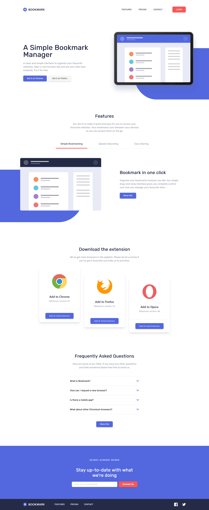

# Frontend Mentor - Bookmark landing page solution

This is a solution to the [Bookmark landing page challenge on Frontend Mentor](https://www.frontendmentor.io/challenges/bookmark-landing-page-5d0b588a9edda32581d29158). Frontend Mentor challenges help you improve your coding skills by building realistic projects.

## Table of contents

- [Overview](#overview)
  - [The challenge](#the-challenge)
  - [Screenshot](#screenshot)
  - [Links](#links)
- [My process](#my-process)
  - [Built with](#built-with)
  - [What I learned](#what-i-learned)
  - [Continued development](#continued-development)
  - [Useful resources](#useful-resources)
- [Author](#author)

## Overview

### The challenge

Users should be able to:

- View the optimal layout for the site depending on their device's screen size
- See hover states for all interactive elements on the page
- Receive an error message when the newsletter form is submitted if:
  - The input field is empty
  - The email address is not formatted correctly

### Screenshot



### Links

- Solution URL: [Repository Link](https://github.com/mjclaypool/Bookmark-Landing-Page)
- Live Site URL: [Live Link](https://mjclaypool.github.io/Bookmark-Landing-Page/)

## My process

### Built with

- Semantic HTML5 markup
- Flexbox
- Mobile-first workflow
- [React](https://reactjs.org/) - JS library
- [Tailwind CSS](https://tailwindcss.com/) - For styles
- [Framer Motion](https://www.framer.com/motion/) - For animations

### What I learned

After completing the challenge objectives, I used Framer Motion to animate sliding an active-tab indicator in the Features section, rotating accordion carets with expand/close interactions in the FAQ section, and scaling buttons throughout the page with hover and click effects. In creating the sliding active-tab indicator, I was excited to learn how to use layout animations to automatically animate position and sizing changes.

```js
{tab == "bookmarking" ?
  <motion.div layoutId="tab-indicator" className="w-full border-b-4 border-b-soft-red" />
:
  <div className="border-b-4 border-transparent"/>
}
```

### Continued development

While completing this challenge, I learned how to create .svg files from scratch and manipulate their styling with CSS. I had some difficulty targeting style properties when using Tailwind CSS, so I plan to spend more time learning and practicing for future applications.

### Useful resources

- [Tailwind CSS Documentation](https://tailwindcss.com/docs/installation) - This well-documented reference website helped me efficiently transition from vanilla CSS to Tailwind CSS. It is a popular CSS framework that promotes increased efficiency in styling applications.

- [Framer Motion Documentation](https://www.framer.com/motion/) - This site helped me build fun, interactive elements with ease. Recommend to anyone who finds themselves building complicated keyframe queries, or to anyone just looking to add some flair for animations and gestures.

## Author

- Website - [Mallory Claypool](https://mjclaypool.github.io/Personal-Portfolio/)
- Frontend Mentor - [@mjclaypool](https://www.frontendmentor.io/profile/mjclaypool)